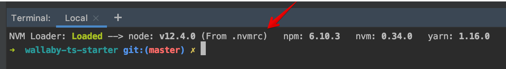

# Typed Node ENV

<p align="center">
  <a target="_blank" href="https://www.gnu.org/licenses/gpl-3.0">
    
  </a>
  <a target="_blank" href="https://www.npmjs.com/package/@z-brain/typed-node-env">
    
  </a>
  <a target="_blank" href="https://www.npmjs.com/package/@z-brain/typed-node-env">
    
  </a>
  <a target="_blank" href="https://snyk.io/test/npm/typed-node-env">
    
  </a>
  <a target="_blank" href="https://github.com/z-brain/typed-node-env/actions?query=workflow%3A%22Build%22">
    
  </a>
  <a target="_blank" href="https://codecov.io/gh/z-brain/typed-node-env">
    
  </a>
</p>

<p align="center">🧨 &nbsp;&nbsp; 💥 &nbsp;&nbsp; 💪 &nbsp;&nbsp; <strong>Strictly typed access and type-casting for ENV variables</strong> &nbsp;&nbsp; ✅ &nbsp;&nbsp; 👨‍💻 &nbsp;&nbsp; 😎</p>

<p>&nbsp;</p>
<p><i>Notice: If you have any propositions feel free to make an issue or create a pull request.</i></p>

## :package: Installation

`yarn add @z-brain/typed-node-env`  
or  
`npm i -s @z-brain/typed-node-env`

## :running: Get started

Create a config class with decorated properties `config.ts`

```typescript
import { EnvString, EnvInteger, EnvBoolean, Environment } from '@z-brain/typed-node-env';

@Environment()
export class EnvConfig {
  @EnvString()
  public readonly host!: string;

  @EnvInteger()
  public readonly port!: number;

  @EnvBoolean()
  public readonly production!: boolean;
}

const config = new EnvConfig();

console.log(
  config.host === 'test.net',
  config.port === 3000,
  config.production === false,
);
```

Due to the used decorators, the values for all properties can now be set via environment variables:

```sh
HOST=test.net PORT=3000 PRODUCTION=false ts-node config.ts
```

## :tada: Benefits

- Type safety for your configuration:
  - No need to maintain a separate TypeScript interface
  - Types can be infered from the property's default value
  - Enforce correct types for values passed by environment variables and notifies about errors
  - Type-casting. For example fields with `boolean` type are correctly recognized from the well-known stringified values: `'true'/'false'/'1'/'0'`
  - Automatically handles any kind of array types
- Take advantage of having a configuration class:
  - Calculate config values based on other config values (e.g. `url` from `host` and `port`)
  - Getter functions (e.g. `get debugPort() { return this.port + 1000; }`)
  - Inherit from other configuration classes
- Enforce configuration values to be read-only at compile time ([readonly modifier](https://www.typescriptlang.org/docs/handbook/classes.html#readonly-modifier)) and at runtime (`enforceReadonly` option)
- Load environment variables from a local file (using [dotenv](https://www.npmjs.com/package/dotenv/v/6.2.0))

## :warning: Human-readable error messages

* A required ENV variable is absent:  
  `NoEnvVarError: Variable "BASE_URL" is required for AppConfig.baseUrl`
* ENV variable value can't be casted to the specified type:   
  ```
  TypeCastingError: AppConfig.debug: Boolean-like value expected, something else is gotten.
      Raw Value (string): "000"
      Env Var Name: "DEBUG"
      Is Array: false
  ```
* Int expected, a float has been gotten:  
  ```
  AppConfig.logLevel: An Integer number expected, a Float is gotten.
      Raw Value (string): "11.1"
      Env Var Name: "LOG_LEVEL"
      Is Array: false
  ```
 * Int array expected, one item of array is a string:   
   ```
   TypeCastingError: Config.adminUserIDs: An Integer number expected, NaN is gotten.
       Raw Value (string): "11,22,abc,33"
       Env Var Name: "ADMIN_USER_IDS"
       Is Array: true
   ```

## :books: Documentation

### All decorators

* Type Casting property decorators
    * `@EnvInteger()`
    * `@EnvFloat()`
    * `@EnvString()`
    * `@EnvBoolean()`
    * `@EnvEnum()`
* Other
    * `@EnvNested()` To create nested configuration objects
    * `@Environment()` Wraps class and makes `.loadEnvConfig()` call during instantiating

### Class property name & ENV variable name

Usually we write class properties in `camelCase` notation and environment variable names in `SCREAMING_SNAKE_CASE` notation. How can we relate them?
1. In a simple case `typed-node-env` package does internal transformation of class property name from came-case to ENV variable name in screaming-snake-case.
2. You can specify custom ENV name for a field.
   ```typescirpt
     @EnvInteger('APP_PORT')
     public port!: number;
   ```
3. It is possible to specify multiple ENV names for the same property.  
   In this case `typed-node-env` tries to find a first existing ENV variable in the order in which the names listed.
   @EnvInteger(['PORT', 'APP_PORT', 'HTTP_PORT'])
   public port!: number;
4. In case of nested object configured using `@EnvNested()` decorator
   1. By default, names of the property that contains a nested object is concatenated to each property name of the nested object.
      ```typescript
      class DbConfig {
        @EnvString()
        public host!: string; // <--- DB_HOST
      
        @EnvInteger('PWD')
        public password!: string; // <--- DB_PWD (custom name is prefixed too)
      }
      
      class Config {
        @EnvNested()
        public db!: DbConfig;
      }
      ```
   2. Also, you can customize prefix name `@EnvNested('MY_PREFIX')`
5. It even possible to use the same config class for different fields to make complex nested object.
   ```typescript
   class DbInsConfig {
     @EnvString()
     public host!: string;
     @EnvString()
     public login!: string;
     @EnvString()
     public password!: string;
   }
   class DbConfig {
     @EnvNested()
     master!: DbInsConfig;
     @EnvNested()
     slave!: DbInsConfig;
   }
   @Environment()
   class Config {
     @EnvNested()
     public db!: DbConfig;
   }
   const env = new Config();
   ```
   This config is looking for next variables:
   ```
   DB_MASTER_HOST      # ---> env.db.master.host
   DB_MASTER_LOGIN     # ---> env.db.master.login
   DB_MASTER_PASSWORD  # ---> env.db.master.password
   DB_SLAVE_HOST       # ---> env.db.slave.host
   DB_SLAVE_LOGIN      # ---> env.db.slave.login
   DB_SLAVE_PASSWORD   # ---> env.db.slave.password
   ```

### Instantiating

1. The classic way is using `new` keyword.  
   To use this way the config class should be decorated with `@Environment()` decorator.  
   Notice: Internally during the instantiating of the class `Environment` decorator uses `loadEnvConfig` function under the hood.
   ```typescript
   @Environment
   class EnvConfig {
     // ...
   }
   const env = new EnvConfig();
   ```
2. Manual `loadEnvConfig()` function call.  
   It can be helpful if by some reasons you don't have to instantiate the config manually using `new` keyword.
   `loadEnvConfig` function works with both class constructors and with instances.
   ```typescript
   // No @Environment() decorator here
   class EnvConfig {
     // ...
   }
   // env1 is a filled instance of EnvConfig
   const env1 = loadEnvConfig(EnvConfig);
   
   const env2Empty = new EnvConfig(); // totally empty object without any fields
   const env2 = loadEnvConfig(env2Empty);
   expect(env2Empty).toBe(env2);

   expect(env2).toEqual(env1); // all fields are equal
   ```

### `.allowEmpty` flag

1. The default behavior is throwing an error about absent ENV variable in case the value of the variable is an empty string or a string filled only with spaces.
2. If we are decorate fields with any of `@Env*({ allowEmpty: true })` decorators such "empty" values will be consumed and passed to type casting function.  
   Here is a table of values to which such values will be converted by different decorators:  
   
   | decorator | input value | result |
   | --- | --- | --- |
   | `EnvBoolean` | `'   '` or `''` | `false` |
   | `EnvFloat` | `'   '` or `''` | `0` |
   | `EnvInteger` | `'   '` or `''` | `0` |
   | `EnvString` | `'   '` | `'   '` |
   | `EnvString` | `''` | `''` |
   | `EnvEnum` | `''` | throws error except cases when an empty<br>string is a enum option value |
   | `EnvEnum` | `'  '` | throws error except cases when `'   '` string<br>is a enum option value |

### Handling arrays

Typed Node Env automatically detects array type and splits input ENV variables data by commas (`,`).

```
enum ETest {
  One  = 'one',
  Two  = 'two',
  Three = 'three',
}
@Environment()
class EnvConfig {
  @EnvString()
  public hosts!: string[]        // [ 'my.com', 'your.net' ]

  @EnvInteger()
  public ports!: number[]        // [ 80, 8080 ]

  @EnvFloat()
  public percentages!: number[]  // [ 0.75, 2.3 ]

  @EnvBoolean()
  public mask!: boolean[]        // [ false, false, true, false ]

  @EnvEnum(ETest)
  public testEnum!: ETest[]      // [ 'One', 'Two' ]
}
const env = new EnvConfig();
```

ENV variables
```bash
HOSTS=my.com,your.net
PORTS=80,8080
PERCENTAGES=0.75,2.3
MASK=false,false,true,false
TEST_ENUM=One,Two
```

### Similar projects

* https://github.com/igabesz/config-decorators
* https://github.com/jbpionnier/env-decorator
* https://github.com/Hippocrate/env-decorator
* https://github.com/derbenoo/ts-configurable

## :wrench: Development notes

### Quick Start

```bash
cd /code/z-brain
git clone git@github.com:z-brain/typed-node-env.git
cd typed-node-env
yarn install
```

### How to use NodeJS version from the `.nvmrc`

1. Install NVM
2. Use `.nvmrc` file one of the next ways:

    * Execute `nvm use` in the project root directory
    * Install [NVM Loader](https://github.com/korniychuk/ankor-shell) and your .nvmrc will be loaded automatically when you open the terminal.
      

### How to make a build

`npm run build`

### How to run lint

* Just show problems `npm run lint`
* Fix problems if it is possible `npm run lint:fix`

### How to run tests

* All tests

  `npm run test`  
  `npm run test:watch`
* Specific tests

  `npm run test -- src/my.spec.ts`  
  `npm run test:watch -- src/my.spec.ts`

### How to build and publish NPM package

*NPM Token:* `6cf9...7ab8`

CI configuration details are here: [.github/workflows/npmpublish.yml](.github/workflows/npmpublish.yml)

```bash
npm run pre-push
&& npm version patch -m 'Update package version version to %s'
&& npm run gen-public-package.json
&& cp README.md dist/
&& npm publish dist --access public
&& git push --no-verify && git push --tags --no-verify
```

### How to build a package for local installation

1. `yarn run build:local`
2. Then you can install a local package build from path `file:.../typed-node-env/dist`.

## :man_technologist: Author

| [<br /><sub>Anton Korniychuk</sub>](https://korniychuk.pro) |
| :---: |
